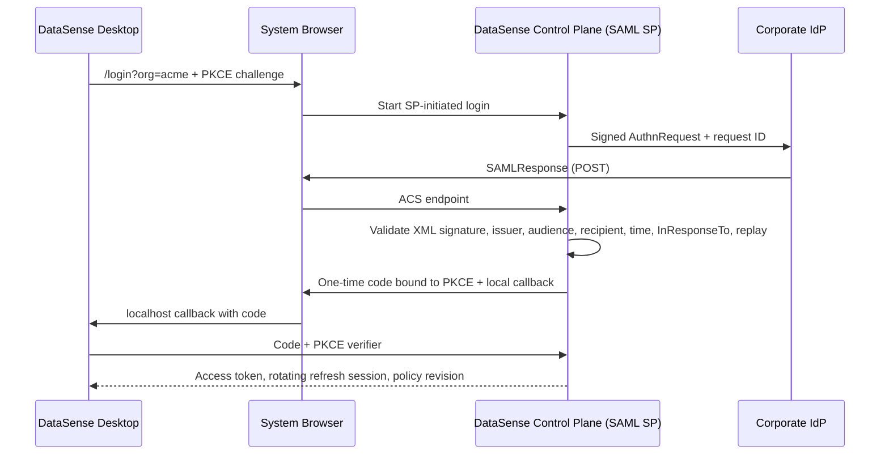

# راهنمای فنی milestone بعدی DataSense: هویت سازمانی و کیفیت داده

**دامنه:** نسخهٔ 2.2.1 یک برنامهٔ دسکتاپِ محلی با Trust Center است. milestone بعدی باید **control plane سازمانی** اضافه کند تا هویت، سیاست مجوز، ثبت رخداد و همگام‌سازی policy خارج از فایل پروژه و خارج از دستگاه کاربر اعمال شود. این تمایز حیاتی است: مخفی‌کردن یک دکمه در رابط دسکتاپ، کنترل دسترسی نیست؛ تصمیم مجوز باید در لایهٔ قابل‌اعتمادِ سرور نیز بررسی شود.

> مدل RBAC، ارتباط کاربران، نقش‌ها، مجوزها، عملیات و اشیاء را جدا می‌کند و نگاشت‌های کاربر–نقش و نقش–مجوز را بسیاری‌به‌بسیاری تعریف می‌کند.[1]

## 1. معماری پیشنهادی RBAC و SSO/SAML

| جزء | مسئولیت | فناوری/الگوی پیشنهادی |
|---|---|---|
| **DataSense Desktop** | نمایش وضعیت ورود، دریافت توکن کوتاه‌عمر، enforcement تجربهٔ کاربری، اجرای آفلاین محدود | PySide6؛ مرورگر سیستم؛ callback محلی؛ Keychain/Windows Credential Manager برای refresh token |
| **Enterprise Control Plane** | سازمان‌ها، عضویت، policy evaluation، SAML Service Provider، audit trail، license و sync | FastAPI یا سرویس Python مجزا؛ PostgreSQL؛ HTTPS عمومی؛ KMS/HSM برای کلیدها |
| **Identity Provider** | احراز هویت و MFA سازمانی | Microsoft Entra ID، Okta، Keycloak یا IdP سازگار با SAML 2.0 |
| **Policy Enforcement Point** | جلوگیری از عملیات محافظت‌شده | API سمت سرور؛ مشتری فقط UX را منعکس می‌کند، نه اینکه مرجع تصمیم باشد |
| **Audit & Evidence Store** | رخدادهای append-only و شواهد خروجی کیفیت | PostgreSQL + object storage با retention policy و hash شواهد |

### چرا SAML را داخل کلاینت دسکتاپ مستقیماً پیاده نکنیم؟

برای محصول سازمانی، یک **broker مرکزی** بهتر از تبدیل هر نصب دسکتاپ به SAML Service Provider است. DataSense Control Plane با یک ACS عمومی و پایدار، Service Provider هر سازمان خواهد بود؛ کلاینت دسکتاپ فقط مرورگر سیستم را باز می‌کند، یک authorization code کوتاه‌عمرِ متصل به PKCE دریافت می‌کند و سپس آن را برای access token کوتاه‌عمر و refresh session چرخشی مبادله می‌کند. این الگو، کلیدهای SAML، metadata، سیاست گواهی، replay detection و audit را در یک مرز قابل‌کنترل نگه می‌دارد.



SAML 2.0 Web Browser SSO باید در نسخهٔ اول با جریان **SP-initiated** آغاز شود. OWASP بر TLS، اعتبارسنجی امضا، بررسی `InResponseTo`، اعتبارسنجی schema، انتخاب دقیق عناصر XML و جلوگیری از replay تأکید می‌کند.[2] IdP-initiated SSO فقط پس از آماده‌شدن کنترل‌های ضد replay و allowlist دقیق RelayState فعال شود.

### مدل دادهٔ هویت و مجوز

```text
organizations(id, slug, policy_revision, ...)
identities(id, issuer, subject, email, display_name, ...)
memberships(id, organization_id, identity_id, status, ...)
roles(id, organization_id nullable, key, display_name, hierarchy_rank)
permissions(id, key, resource_type, action)
role_permissions(role_id, permission_id)
membership_roles(membership_id, role_id)
project_members(project_id, membership_id, access_scope)
saml_connections(id, organization_id, entity_id, sso_url, metadata_hash, cert_set, enabled)
auth_sessions(id, membership_id, refresh_token_hash, device_id, expires_at, revoked_at)
audit_events(id, organization_id, actor_id, action, resource_type, resource_id, outcome, correlation_id, occurred_at, payload_hash)
```

مدل NIST این تفکیک نقش، مجوز، عملیات و شیء را مبنای استاندارد RBAC می‌داند.[1] در DataSense، `organization_id` باید روی تمام منابع سازمانی قرار گیرد و در هر query و هر تصمیم policy حضور داشته باشد.

| نقش اولیه | مجوزهای نمونه | مرز مهم |
|---|---|---|
| **Owner** | مدیریت subscription، اتصال IdP، نقش‌ها، retention و خروجی audit | نقش break-glass؛ حداقل دو نفر و MFA اجباری |
| **Admin** | مدیریت عضویت، نقش‌های تعریف‌شده و اتصال‌ها | نمی‌تواند مالک را حذف یا billing را تغییر دهد |
| **Data Steward** | ایجاد/ویرایش/اجرای contract، تعیین طبقه‌بندی و رسیدگی به failure | نمی‌تواند نقش یا SSO را تغییر دهد |
| **Analyst** | واردسازی، تحلیل و اجرای contractهای مجاز | export فقط برای datasetهای مجاز |
| **Viewer** | مشاهدهٔ پروژه و گزارش‌های مجاز | بدون ویرایش، حذف یا export پیش‌فرض |
| **Auditor** | مشاهده و export شواهد audit و گزارش کیفیت | read-only، بدون مشاهدهٔ مقادیر حساس خام |

### الگوی authorization

مجوزها را به‌صورت رشته‌های پایدار و ریزدانه تعریف کنید؛ برای مثال `project.read`، `project.write`، `dataset.import`، `dataset.export`، `contract.read`، `contract.edit`، `contract.run`، `contract.override_block`، `audit.read`، `audit.export`، `identity.manage` و `sso.manage`. نقش‌ها صرفاً مجموعه‌هایی از این مجوزها هستند؛ policy را در کد رابط کاربری hard-code نکنید.

```python
# سمت سرور؛ هر API محافظت‌شده باید این نقطهٔ تصمیم را فراخوانی کند.
def authorize(subject, action: str, resource) -> None:
    if subject.organization_id != resource.organization_id:
        raise Forbidden("cross-tenant access")
    allowed = policy_store.has_permission(
        membership_id=subject.membership_id,
        permission=action,
        resource_type=resource.type,
        resource_id=resource.id,
    )
    audit("authorization.checked", subject, action, resource, outcome="allow" if allowed else "deny")
    if not allowed:
        raise Forbidden(action)
```

در نسخهٔ نخست، RBAC خالص را برای ساده‌ماندن audit پیاده کنید. برای مرحلهٔ بعد، یک **ABAC overlay** کوچک اضافه کنید: `data_classification <= member.clearance`، منطقهٔ داده، project membership و corporate network requirement. این overlay نباید نقش‌های سازمانی را تکثیر کند.

### جریان SAML و کنترل‌های اجباری

1. مدیر سازمان metadata IdP یا URL metadata امضاشده را وارد می‌کند. سامانه `entityID`، SSO URL و کلیدهای امضا را استخراج، hash و به‌صورت versioned نگه می‌دارد.
2. Control Plane برای هر login یک `request_id` تصادفی، زمان انقضای کوتاه، PKCE challenge، `RelayState` داخلی و مقصد مجاز ثبت می‌کند و AuthnRequest را می‌سازد.
3. ACS فقط assertionی را می‌پذیرد که **امضای XML معتبر با کلید trusted/pinned** داشته باشد؛ `Issuer`، `AudienceRestriction`، `Recipient`، `Destination`، `InResponseTo`، `NotBefore`، `NotOnOrAfter` و Subject Confirmation آن با connection و request منطبق باشد.
4. Response و assertion در replay cache اتمی ثبت می‌شوند؛ مصرف دوباره همان ID رد می‌شود. assertion کوتاه‌عمر و clock skew حداکثر 120 ثانیه باشد.
5. NameID پایدار یا attribute موردتوافق به `identity(issuer, subject)` نگاشت می‌شود. JIT provisioning فقط اگر policy سازمان اجازه دهد؛ در غیر این صورت کاربر باید قبلاً membership فعال داشته باشد.
6. API یک code یک‌بارمصرف و متصل به PKCE به کلاینت می‌دهد. کلاینت با verifier آن را مبادله می‌کند؛ access token حداکثر 10 دقیقه و refresh session چرخشی با revoke و device binding صادر می‌شود.
7. هر login، deny، role change، metadata update، certificate rotation و export در `audit_events` ثبت می‌شود.

> SAML یک استاندارد باز برای تبادل اطلاعات authentication و authorization است؛ پروفایل Redirect/POST مرورگر از رایج‌ترین الگوهای SSO است.[2]

کنترل‌های غیرقابل مذاکره عبارت‌اند از: TLS اجباری، منع XML external entities، schema محلی و harden‌شده، جلوگیری از XML Signature Wrapping، کلید امضای IdP از metadata مورداعتماد، عدم اعتماد به `KeyInfo` در خود Response، بررسی کامل destination/audience/time، محدودیت نرخ ACS، ذخیره‌نکردن assertion خام در log، redaction attributeها و کلیدهای امضا/رمزنگاری جدا. OWASP استفاده از validation امضا، TTL کوتاه و OneTimeUse/replay control را توصیه می‌کند.[2]

### API و رویدادهای milestone

| Endpoint | عمل | مجوز |
|---|---|---|
| `POST /v1/auth/saml/{org}/start` | ایجاد transaction و redirect به IdP | عمومی، محدودشده به org فعال |
| `POST /v1/auth/saml/{org}/acs` | مصرف SAML Response و صدور code | عمومی، validation کامل SAML |
| `POST /v1/auth/token` | مبادلهٔ code+PKCE یا refresh rotation | code/session معتبر |
| `GET /v1/me/policy` | نقش‌ها، permissionها و policy revision | membership فعال |
| `POST /v1/contracts/{id}/run` | اجرای contract ثبت‌شده | `contract.run` |
| `POST /v1/contracts/{id}/override` | ثبت override دارای دلیل و زمان انقضا | `contract.override_block` |
| `GET /v1/audit/events` | query/redacted export رخدادها | `audit.read` یا `audit.export` |

### rollout و معیار پذیرش

| گام | خروجی | معیار پذیرش |
|---|---|---|
| 1. Control Plane | organization، membership، audit base و Postgres migration | tenant isolation و deny-by-default در آزمون integration |
| 2. RBAC | permission catalog، نقش‌ها، role editor و PEP در API | کاربر Viewer در آزمون نمی‌تواند export یا edit کند؛ denyها audit می‌شوند |
| 3. SAML SP | metadata، SP-initiated login، ACS و token exchange | Entra/Okta sandbox؛ invalid signature، replay و audience mismatch رد می‌شوند |
| 4. Desktop binding | browser login، token storage امن، policy refresh و offline cache امضاشده | تغییر role در کمتر از 60 ثانیه اثر می‌گذارد؛ offline cache تاریخ انقضا دارد |
| 5. Hardening | rotation، SCIM در مرحلهٔ بعد، SIEM export و disaster runbook | tabletop incident؛ certificate rollover بدون قطعی برنامه‌ریزی‌شده |

## 2. موتور اعتبارسنجی قرارداد داده در DataSense 2.2.1

### مدل اجرا

`DataContract` یک مجموعهٔ نام‌دار و قابل‌serialise از `DataQualityRule`ها است. هر rule دارای ستون، نوع rule، پارامترها و سطح شدت (`critical`، `high`، `medium`، `low`) است. با اجرای contract، `evaluate_rule(frame, rule)` برای هر rule یک `QualityCheckResult` تولید می‌کند که شامل status، مقدار مشاهده‌شده، انتظار، تعداد violation و detail است. سپس `QualityReport` شامل timestamp UTC، خلاصه، score و همهٔ resultها تولید و به JSON قابل‌ممیزی export می‌شود.

| نوع rule | منطق 2.2.1 | نکتهٔ مهم |
|---|---|---|
| `not_null` | `series.isna().sum()` باید صفر باشد | مقدارهای null violation هستند |
| `unique` | روی `dropna()`، duplicateها شمارش می‌شوند | nullها را بررسی نمی‌کند؛ در صورت نیاز با `not_null` جفت شود |
| `range` | مقادیر عددی خارج از حداقل/حداکثر violation هستند | تبدیل نامعتبر به عدد در این نسخه violation نیست؛ `numeric_type` rule برای مرحلهٔ بعد توصیه می‌شود |
| `allowed_values` | مقادیر non-null باید در allowlist باشند | nullها جداگانه با `not_null` مدیریت شوند |
| `regex` | مقدارهای non-null باید با `fullmatch(pattern)` منطبق شوند | regex نامعتبر به `error` تبدیل می‌شود |
| `freshness` | جدیدترین timestamp قابل‌parse باید در `max_age_days` باشد | اگر هیچ timestamp معتبری نباشد، result=`error` است |

### امتیاز کیفیت وزن‌دار

امتیاز در 2.2.1 یک **weighted pass-rate در سطح rule** است، نه درصد سطرهای سالم. ابتدا گزارش، تمام resultهای دارای status `pass`، `fail` یا `error` را در `evaluated` وارد می‌کند. وزن شدت‌ها چنین است:

| شدت | وزن |
|---|---:|
| `critical` | 4 |
| `high` | 3 |
| `medium` | 2 |
| `low` | 1 |
| شدت ناشناخته | 2، یعنی پیش‌فرض `medium` |

فرمول دقیق:

\[
Score = round\left(100 \times \frac{\sum_{r \in Pass} w(r)}{\sum_{r \in Evaluated} w(r)}, 1\right)
\]

`error` در مخرج می‌آید اما وزنش به صورت نمی‌آید؛ بنابراین به امتیاز آسیب می‌زند. اگر هیچ rule ارزیابی‌شده‌ای وجود نداشته باشد، score برابر `None` یا «Not configured» است، نه صفر. وضعیت نیز به ترتیب اولویت زیر تعیین می‌شود:

1. بدون result ارزیابی‌شده → `not configured`.
2. هر `error` → `needs attention`.
3. هر `fail` با شدت `critical` → `blocked`.
4. هر `fail` دیگر → `needs attention`.
5. در غیر این صورت → `trusted`.

**مثال:** اگر `not_null` بحرانی fail شود (وزن 4)، `unique` با شدت high pass شود (وزن 3) و `regex` با شدت low pass شود (وزن 1)، آنگاه score برابر \(100 \times (3+1)/(4+3+1)=50.0\%\) است و status با وجود امتیاز 50%، `blocked` خواهد بود. این جداسازی «امتیاز» از «گیت انتشار» طراحی درستی است: یک failure بحرانی نباید با تعداد زیادی check کم‌اهمیت پنهان شود.

### محدودیت عمدی و تکامل پیشنهادی

در نسخهٔ فعلی، یک rule با یک violation و یک rule با هزار violation هر دو از نظر score، وزن کامل خود را از دست می‌دهند؛ تعداد `violations` برای evidence نشان داده می‌شود ولی وارد فرمول نیست. برای milestone بعدی، دو metric مستقل اضافه کنید:

\[
Compliance_r = 1 - \min(1, violations_r / eligible\_rows_r)
\]
\[
Risk\text{-}adjusted\ score = 100 \times \frac{\sum_r w(r) \times Compliance_r}{\sum_r w(r)}
\]

در کنار score کنونی، trend زمانی، sample coverage، SLA freshness، per-segment quality، threshold برای gradual warning/block و استثنای time-boxed دارای مالک اضافه شود. score فعلی برای **گیت قابل‌توضیح و ممیزی** نگه داشته شود؛ score جدید برای **پایش شدت نقص** افزوده شود.

## References

[1]: https://csrc.nist.gov/projects/role-based-access-control "NIST Role-Based Access Control"
[2]: https://cheatsheetseries.owasp.org/cheatsheets/SAML_Security_Cheat_Sheet.html "OWASP SAML Security Cheat Sheet"
[3]: https://docs.oasis-open.org/security/saml/v2.0/saml-profiles-2.0-os.pdf "OASIS SAML 2.0 Profiles"
