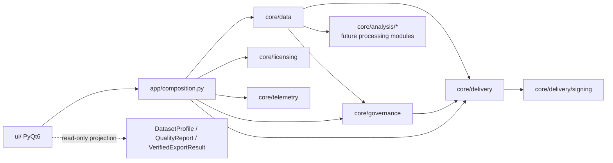

# مرجع API و قرارداد اتصال ماژول‌های پردازش به هستهٔ DataSense

**نسخهٔ مبنا:** Alpha 0.1.0  
**دامنه:** قراردادهای داخلی Python برای برنامهٔ Windows-first و local-first DataSense. این سند API عمومی تحت HTTP نیست؛ مرجع اتصال امن و تست‌پذیر ماژول‌های Python به هستهٔ Desktop است.

> **قانون داده:** UI، telemetry، receipt و license service نباید مقدار خام DataFrame، مسیر محلی فایل، نام credential یا query منبع داده را دریافت کنند. ماژول‌های پردازش تنها در فضای `core` به DataFrame دسترسی دارند و خروجی آن‌ها باید DTO یا aggregate قابل‌نمایش باشد.

## ۱. نقشهٔ ماژول‌ها و جریان وابستگی



| لایه | مجاز است انجام دهد | نباید انجام دهد |
|---|---|---|
| `ui/` | دریافت input، نمایش DTO، فراخوانی service، نمایش error قابل‌اقدام | `pandas` transform، ساخت receipt، استخراج credential، تصمیم quality |
| `app/` | ساخت dependencyها و نگهداری state session | محاسبهٔ domain یا serialization data |
| `core/data` | import محلی، validation، profile، تبدیل و ساخت DataFrame | import PyQt، telemetry یا HTTP مستقیم |
| `core/governance` | policy، contract، rule evaluation و report | dialog UI یا write artifact |
| `core/delivery` | تصمیم export، receipt، report و verify | نگهداری کلید یا تحلیل مستقیم valueهای raw |
| `core/delivery/signing` | interface و implementation امضا | export/report/UI |
| `core/analysis/*` | محاسبهٔ آماری/ML/transform از روی frame | import UI یا mutate state global |
| `core/telemetry` | صف opt-in و redaction allowlist | دریافت frame، filename، values یا query |

## ۲. composition root و قرارداد تزریق وابستگی

`app/composition.py` تنها محل ساخت implementationهای زیر است. ماژول‌های domain نباید singleton global یا مسیر hard-coded بسازند.

```python
services = Services(
    data=DataService(),
    delivery=VerifiedExportService(),
    signing_provider=FileHmacSigningKeyProvider(data_dir / "signing" / "alpha-local-signing.key"),
    projects=ProjectStore(data_dir / "projects"),
    feature_gate=FeatureGate(entitlement),
    telemetry=TelemetryQueue(data_dir / "telemetry" / "events.jsonl"),
    state=ApplicationState(),
)
```

| عضو `Services` | interface مصرف‌کننده | lifecycle | مرز privacy |
|---|---|---|---|
| `data` | `DataService` | session | DataFrame فقط local memory |
| `delivery` | `VerifiedExportService` | stateless | receipt فقط aggregate metadata |
| `signing_provider` | `SigningKeyProvider` | installation/session | کلید هرگز به UI یا receipt نمی‌رود |
| `projects` | `ProjectStore` | installation | داده در پروژهٔ local ذخیره می‌شود |
| `feature_gate` | `FeatureGate` | entitlement refresh | فقط plan/feature در اختیار UI |
| `telemetry` | `TelemetryQueue` | session | با consent و field allowlist |
| `state` | `ApplicationState` | window/session | frame فقط در process local |

### قاعدهٔ تزریق برای ماژول جدید

هر module جدید باید constructor injection داشته باشد. برای نمونه، module تحلیل نباید خود `DataService` یا `TelemetryQueue` ایجاد کند؛ caller context را می‌سازد و نتیجه را دریافت می‌کند.

```python
@dataclass(frozen=True)
class AnalysisContext:
    project_id: str
    locale: str
    cancellation: CancellationToken

@dataclass(frozen=True)
class AnalysisResult:
    module_id: str
    summary: dict[str, int | float | str]
    artifacts: tuple[ArtifactDescriptor, ...]
    warnings: tuple[str, ...]

class ProcessingModule(Protocol):
    module_id: str

    def analyze(self, frame: pd.DataFrame, context: AnalysisContext) -> AnalysisResult:
        """Must be deterministic for an identical frame and configuration."""
```

## ۳. API هستهٔ داده

### ۳.۱ `DataService`

```python
service = DataService()
frame = service.load_csv(path, encoding="utf-8", delimiter=None)
profile = service.profile(frame)
sample = service.sample_dataset()
```

| متد | ورودی | خروجی | خطا | قرارداد |
|---|---|---|---|---|
| `load_csv(path, encoding, delimiter)` | مسیر local به CSV/TSV/TXT | `pd.DataFrame` copy شده | `DatasetLoadError` | فایل، suffix، parser، encoding و خالی نبودن بررسی می‌شود. |
| `sample_dataset()` | ندارد | `pd.DataFrame` | ندارد | فقط دادهٔ demo غیرحساس برمی‌گرداند. |
| `profile(frame)` | DataFrame معتبر | `DatasetProfile` immutable | `DatasetLoadError` یا `TypeError` | فقط aggregateهای rows/columns/missing/duplicates/memory و column summary برمی‌گرداند. |

`DatasetProfile` یک projection امن برای UI و delivery است. استفادهٔ مستقیم از DataFrame در widgetها ممنوع است، به‌جز preview کنترل‌شدهٔ local که در `MainWindow` محدود به ۱۰۰ ردیف است.

```python
profile.to_dict()
# {
#   "rows": 42,
#   "columns": 6,
#   "missing_cells": 3,
#   "duplicate_rows": 0,
#   "memory_mb": 0.003,
#   "column_summaries": [{"column": "order_id", "dtype": "object", ...}]
# }
```

### ۳.۲ افزودن data loader جدید

برای افزودن XLSX یا database connector، facade فعلی را نشکنید. یک adapter بنویسید و بعد از دریافت DataFrame، حتماً آن را از validation مشترک عبور دهید.

```python
class ExcelLoader:
    def load(self, path: Path, sheet_name: str | int = 0) -> pd.DataFrame:
        frame = pd.read_excel(path, sheet_name=sheet_name)
        return DataService._validate_frame(frame)  # در نسخهٔ بعدی public validator/extractor شود
```

معیار پذیرش adapter: timeout/cancellation برای I/O، message قابل‌اقدام، test fixture synthetic، عدم ذخیرهٔ connection string در log و خروجی DataFrame با columnهای یکتا.

## ۴. API governance و data contract

### ۴.۱ مدل‌ها

```python
rule = DataQualityRule("not_null", "order_id", "critical")
contract = DataContract("Monthly operations", (rule,))
report = contract.evaluate(frame)
```

| نوع | نقش | invariant |
|---|---|---|
| `DataQualityRule` | تعریف یک کنترل | rule type و severity معتبر و column غیرخالی |
| `RuleResult` | نتیجهٔ immutable یک کنترل | violations غیرمنفی |
| `QualityReport` | جمع نتایج | `approved` فقط اگر failure blocking نداشته باشد |
| `DataContract` | مجموعهٔ ruleها | نام غیرخالی و عدم وجود rule تکراری برای column/type |

### ۴.۲ سیاست تصمیم

| severity | نتیجهٔ rule failed | اثر verified export |
|---|---|---|
| `critical` | مسدود | artifact ساخته نمی‌شود؛ receipt blocked نوشته می‌شود |
| `high` | مسدود | artifact ساخته نمی‌شود؛ receipt blocked نوشته می‌شود |
| `medium` | advisory | artifact مجاز، finding قابل‌مشاهده |
| `low` | advisory | artifact مجاز، finding قابل‌مشاهده |

```python
report.summary()
# {
#   "status": "approved" | "blocked",
#   "rules": int,
#   "failed_rules": int,
#   "blocking_failures": int,
#   "total_violations": int,
# }
```

### ۴.۳ افزودن rule جدید

توسعه‌دهنده نباید `if/elif`های پراکنده در UI اضافه کند. rule evaluator باید در `core/governance` ثبت شود، test شود و خروجی استاندارد `RuleResult` تولید کند.

```python
# الگوی توسعهٔ بعدی: registry به‌جای شرط‌های طولانی
RuleEvaluator = Callable[[pd.Series, DataQualityRule], tuple[int, str]]
RULE_EVALUATORS: dict[str, RuleEvaluator] = {
    "not_null": evaluate_not_null,
    "unique": evaluate_unique,
    "range": evaluate_range,          # future
    "regex": evaluate_regex,          # future
    "allowed_values": evaluate_allowed_values,  # future
}
```

هر rule جدید باید حداقل این آزمون‌ها را داشته باشد: happy path، violation، column missing، null semantics، severity blocking/advisory، serialization/`to_rows` و regression با دادهٔ synthetic.

## ۵. API delivery و receipt verification

### ۵.۱ سرویس خروجی

```python
result = services.delivery.export_html(
    path="out/operations-report.html",
    frame=frame,
    profile=profile,
    quality=report,
    signing_provider=services.signing_provider,
)
```

| عضو `VerifiedExportResult` | معنا |
|---|---|
| `decision` | allow/block و reason code |
| `artifact_path` | فقط در تصمیم allow، مسیر HTML؛ در block برابر `None` |
| `receipt_path` | همواره مسیر JSON امضاشدهٔ metadata-only |
| `receipt_sha256` | هش receipt نهایی برای reference/compare |

`export_html` نخست سازگاری frame/profile را بررسی می‌کند، سپس receipt را به‌شکل atomic می‌نویسد. در حالت allow، HTML aggregate-only پس از receipt ساخته می‌شود. در حالت block، HTML اصلاً نوشته نمی‌شود.

### ۵.۲ provider امضا

```python
class SigningKeyProvider(Protocol):
    @property
    def key_id(self) -> str: ...
    @property
    def algorithm(self) -> str: ...
    def sign(self, payload: bytes) -> bytes: ...
    def verify(self, payload: bytes, signature: bytes) -> bool: ...
```

| implementation | کاربرد | محدودیت |
|---|---|---|
| `InMemoryHmacSigningKeyProvider` | unit test و preview کوتاه | key فقط در process زنده است |
| `FileHmacSigningKeyProvider` | Alpha local | باید در production با DPAPI/Credential Manager یا key service جایگزین شود |
| `EnterpriseSigningKeyProvider` (آینده) | Team/Enterprise | نیازمند key id، rotation، audit و policy سازمانی |

```python
is_valid = services.delivery.verify_receipt(result.receipt_path, services.signing_provider)
```

verify باید `False` برگرداند—بدون exception UI—وقتی JSON ناقص، payload/hash، algorithm/key id یا signature تغییر کرده است.

## ۶. قراردادهای UI و binding state

`MainWindow` تنها با `Services` ساخته می‌شود. بعد از import، state به‌روزرسانی شده و فقط projectionهای امن به Dashboard تحویل می‌گردد:

```python
state.frame = frame
state.source_label = label
state.quality_report = None
profile = services.data.profile(frame)
dashboard.update_dashboard(profile, state.quality_report, state.source_label)
```

| رخداد UI | core call | state update | projection UI |
|---|---|---|---|
| Open CSV | `DataService.load_csv` | frame/source/quality reset | profile + table preview + dashboard pending |
| Run checks | `DataContract.evaluate` | quality report | quality table + trust badge + progress |
| Verified export | `VerifiedExportService.export_html` | latest receipt path در UI session | status، hash، مسیر artifact/receipt |
| Verify receipt | `verify_receipt` | ندارد | پیام VALID/INVALID |

### اصول UI

1. UI فقط `DatasetProfile`، `QualityReport` و `VerifiedExportResult` را render می‌کند.
2. UI نباید HMAC key، receipt payload داخلی یا raw data را به telemetry بدهد.
3. preview باید opt-in local و bounded باشد. برای دادهٔ بزرگ، pagination/lazy model در module بعدی لازم است.
4. تغییر dataset همیشه `quality_report` و last receipt UI را invalid می‌کند.
5. پیام block باید دلیل (`reason_code`) و قدم بعدی داشته باشد؛ فقط «خطا» کافی نیست.

## ۷. قرارداد خطا و قابلیت مشاهده

| لایه | نوع خطا | رفتار UI | رفتار log/telemetry |
|---|---|---|---|
| data import | `DatasetLoadError` | dialog قابل‌اقدام | code دسته‌بندی‌شده، بدون path/value |
| governance | configuration `ValueError` | owner/developer error در alpha | issue داخلی؛ raw data ممنوع |
| delivery | profile mismatch یا write error | dialog/retry guidance | error type و app version فقط با opt-in |
| receipt verification | `False` | پیام invalid + عدم اعتماد | هیچ payload receipt به telemetry نرود |

## ۸. checklist توسعهٔ یک پردازشگر جدید

| گام | خروجی لازم |
|---|---|
| تعریف مسئله | `module_id`، owner، input schema و expected DTO |
| مرز داده | مشخص کنید module raw data را می‌بیند یا فقط aggregateها را؛ خروجی نباید data leak کند. |
| interface | implementation `ProcessingModule` با context و result immutable |
| تست | unit tests با fixture synthetic و test cancellation/error paths |
| governance | contract/evidence اثر module را قبل از delivery تعریف کنید |
| UI | view model/DTO جدا؛ ممنوعیت import pandas در widget |
| observability | فقط event allowlist و duration/result bucket پس از consent |
| release | feature gate، changelog و migration/backward compatibility در صورت persistence |

## ۹. نمونهٔ module پردازش مستقل

```python
@dataclass(frozen=True)
class RevenueSummary:
    total: float
    average: float
    count: int

class RevenueSummaryModule:
    module_id = "revenue-summary/v1"

    def analyze(self, frame: pd.DataFrame, context: AnalysisContext) -> AnalysisResult:
        if "revenue" not in frame.columns:
            return AnalysisResult(
                module_id=self.module_id,
                summary={},
                artifacts=(),
                warnings=("Required column 'revenue' is missing.",),
            )
        values = pd.to_numeric(frame["revenue"], errors="coerce").dropna()
        summary = RevenueSummary(float(values.sum()), float(values.mean()) if len(values) else 0.0, len(values))
        return AnalysisResult(
            module_id=self.module_id,
            summary={"total_revenue": summary.total, "average_revenue": summary.average, "row_count": summary.count},
            artifacts=(),
            warnings=(),
        )
```

این module نمی‌داند پنجرهٔ PyQt، مسیر پروژه، credential یا provider telemetry چیست. caller نتیجه را به dashboard یا report adapter تبدیل می‌کند. همین جداسازی است که unit test، reuse و امنیت محلی را قابل‌مدیریت می‌سازد.

## ۱۰. سنجش پوشش فعلی

| روز توسعه | تحویل پیاده‌سازی‌شده | آزمون پوششی |
|---|---|---|
| روز ۲ | import/profile local و validation | loader، suffix/delimiter، empty/missing/duplicate columns، aggregate privacy |
| روز ۳ | data contract و quality report | unique/null/missing/severity/configuration/error |
| روز ۴ | verified export/receipt/signing | allow/block، profile mismatch، tamper detection، suffix normalization |
| روز ۵ | dashboard، preview و binding UI | approved/blocked dashboard و sample flow MainWindow |

**وضعیت Alpha:** `FileHmacSigningKeyProvider` برای مسیر یادگیری مناسب است، اما release production باید provider مبتنی بر حفاظت key ویندوز، installer/code signing و review امنیت مستقل داشته باشد.
