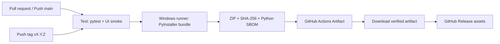

# راهنمای CI/CD ساخت خودکار Windows EXE برای DataSense

این راهنما همراه فایل `.github/workflows/windows-exe.yml` در boilerplate ارائه شده است. گردش‌کار روی runner ویندوزی اجرا می‌شود، آزمون‌ها را پیش از بسته‌بندی اجرا می‌کند، با PyInstaller یک bundle یک‌پوشه‌ای می‌سازد، ZIP و checksum تولید می‌کند، artifact قابل‌دانلود می‌سازد و فقط با push شدن tag نسخه‌دار، دارایی‌ها را در GitHub Release منتشر می‌کند.

> **مرز مهم:** workflow حاضر artifact را می‌سازد، اما به‌صورت پیش‌فرض EXE را code-sign نمی‌کند. تا پیش از تهیهٔ certificate و افزودن مرحلهٔ امضا، فایل را «release عمومی production-ready» تلقی نکنید.

## ۱. ساختار pipeline



GitHub workflowها باید در پوشهٔ `.github/workflows` با پسوند YAML قرار بگیرند.[1] فایل ارائه‌شده سه trigger دارد: pull request به `main`، push به `main` یا tagهای `v*` و اجرای دستی. خروجی build ابتدا با `upload-artifact` بین jobها منتقل می‌شود؛ GitHub این الگو را برای نگهداری و اشتراک فایل‌های build/test پشتیبانی می‌کند.[2]

| job | Trigger | مسئولیت | خروجی |
|---|---|---|---|
| `test-and-package` | PR، main، tag یا اجرای دستی | نصب، test، PyInstaller، ZIP، SHA-256 و SBOM | artifact با retention ۱۴ روز |
| `publish-release` | فقط `refs/tags/v*` | دریافت artifact موفق و attach کردن دارایی‌ها به release | ZIP، checksum و SBOM در Release |

## ۲. فعال‌سازی در repository

1. پوشهٔ `datasense_windows_boilerplate` را به repository موردنظر منتقل یا merge کنید.
2. فایل workflow را با این مسیر commit کنید:

   ```text
   .github/workflows/windows-exe.yml
   ```

3. در GitHub، به **Settings → Actions → General** بروید و مطمئن شوید Actions برای repository فعال است.
4. در **Settings → Actions → General → Workflow permissions**، دسترسی workflow را روی `Read repository contents permission` قرار دهید. خود job انتشار فقط در سطح همان job، `contents: write` دریافت می‌کند.
5. یک pull request کوچک باز کنید. job `test-and-package` باید اجرا شود و artifact را در صفحهٔ Actions نشان دهد.
6. پیش از tag نخست، `APP_NAME` در workflow، version در `pyproject.toml` و release notes را با نسخهٔ موردنظر هم‌راستا کنید.

## ۳. فرمان‌های build و آزمون

workflow روی Windows از این توالی استفاده می‌کند:

```powershell
python -m pip install --upgrade pip
pip install -e .[dev,package]
python -m pytest
pyinstaller --noconfirm --clean --windowed --name DataSenseAlpha --collect-all pandas --collect-all pyarrow main.py
```

| گام | چرایی | شکست رایج |
|---|---|---|
| `pip install -e .[dev,package]` | همان dependencyهای توسعه و بسته‌بندی را نصب می‌کند. | عدم وجود extras یا ناسازگاری Python version |
| `python -m pytest` | تست‌های هسته و UI smoke را اجرا می‌کند. | PyQt headless یا import path |
| `--windowed` | برای GUI ویندوز و بدون console window است. | پنهان‌شدن stack trace؛ برای debug موقتاً حذف شود. |
| `--collect-all pandas/pyarrow` | resourceها و importهای پویا را در bundle می‌آورد. | افزایش حجم bundle؛ بعداً با analysis محدود شود. |
| `Compress-Archive` | bundle یک‌پوشه‌ای را به portable ZIP تبدیل می‌کند. | وجود فایل قفل‌شده یا ساختار dist اشتباه |

پس از ساخت، workflow وجود فایل `dist/DataSenseAlpha/DataSenseAlpha.exe` را بررسی می‌کند. سپس برای EXE و ZIP فایل‌های SHA-256 و یک SBOM ساده از `pip list --format=json` می‌سازد.

## ۴. کنترل کیفیت در Pull Request

هر PR باید فقط job build/test را اجرا کند و هیچ انتشار یا دسترسی write نداشته باشد. Branch protection پیشنهادی:

| تنظیم | مقدار پیشنهادی |
|---|---|
| Required status checks | `Test and package Windows x64` |
| Require pull request review | حداقل یک review برای `core/`، `infra/` و workflowها |
| Require branches up to date | فعال |
| Allow force pushes | غیرفعال |
| Allow GitHub Actions to create/approve PRs | غیرفعال مگر نیاز صریح |
| Secret scanning / Dependabot | فعال |

کاربرد artifact در PR فقط بررسی داخلی است؛ آن را public release نکنید. فایل‌های artifact از نظر GitHub با `upload-artifact`/`download-artifact` انتقال می‌یابند و برای artifact دانلودشده digest به‌صورت خودکار اعتبارسنجی می‌شود.[2]

## ۵. انتشار نسخه با tag

پس از موفقیت PR و merge روی `main`، مدیر انتشار می‌تواند نسخه را بسازد:

```bash
git checkout main
git pull --ff-only
# version و release notes را ابتدا commit کنید
git tag -a v0.1.0 -m "DataSense Alpha 0.1.0"
git push origin v0.1.0
```

push شدن tag مانند `v0.1.0` هر دو job را اجرا می‌کند. job دوم فقط پس از موفقیت job اول artifact را دریافت و با `softprops/action-gh-release` به GitHub Release attach می‌کند. GitHub Releaseها برای تحویل iterationهای پروژه به کاربر و attach کردن فایل‌های باینری طراحی شده‌اند.[3]

> پیش از push tag عمومی، نسخه، release notes، نتایج آزمون، hashها، dependency changes و سیاست rollback را توسط release owner تأیید کنید. tag انتشار را بازنویسی یا force-push نکنید.

## ۶. افزودن code signing در مرحلهٔ production

Windows SmartScreen و اعتماد سازمانی بدون امضای کد می‌توانند مانع نصب شوند. پس از تهیهٔ certificate معتبر، secretهای زیر را در **Settings → Secrets and variables → Actions** ثبت کنید. هرگز فایل PFX یا password را در Git، artifact عمومی یا log چاپ نکنید.

| Secret | محتوا |
|---|---|
| `WINDOWS_CERTIFICATE_BASE64` | فایل PFX به Base64 تبدیل‌شده |
| `WINDOWS_CERTIFICATE_PASSWORD` | گذرواژه PFX |
| `WINDOWS_TIMESTAMP_URL` | URL سرویس timestamp مورد تأیید certificate authority |

این step را **پس از PyInstaller و پیش از ZIP/checksum** اضافه کنید:

```yaml
      - name: Sign executable (tag releases only)
        if: startsWith(github.ref, 'refs/tags/v')
        shell: pwsh
        env:
          CERTIFICATE_BASE64: ${{ secrets.WINDOWS_CERTIFICATE_BASE64 }}
          CERTIFICATE_PASSWORD: ${{ secrets.WINDOWS_CERTIFICATE_PASSWORD }}
          TIMESTAMP_URL: ${{ secrets.WINDOWS_TIMESTAMP_URL }}
        run: |
          if ([string]::IsNullOrWhiteSpace($env:CERTIFICATE_BASE64)) {
            throw "Code-signing certificate is not configured for a tag release."
          }
          $certificatePath = Join-Path $env:RUNNER_TEMP "datasense-signing.pfx"
          [IO.File]::WriteAllBytes($certificatePath, [Convert]::FromBase64String($env:CERTIFICATE_BASE64))
          $exe = "dist/$env:APP_NAME/$env:APP_NAME.exe"
          & signtool sign /fd SHA256 /f $certificatePath /p $env:CERTIFICATE_PASSWORD /tr $env:TIMESTAMP_URL /td SHA256 $exe
          if ($LASTEXITCODE -ne 0) { exit $LASTEXITCODE }
          & signtool verify /pa /v $exe
          if ($LASTEXITCODE -ne 0) { exit $LASTEXITCODE }
          Remove-Item $certificatePath -Force
```

در سطح production بهتر است certificate را با provider مبتنی بر key vault یا code-signing service نگهداری کنید تا PFX در runner موقت نیز بازسازی نشود. اسکریپت بالا فقط نمونهٔ انتقالی است.

## ۷. افزودن installer و انتشار امن‌تر

برای installer نهایی، بعد از build bundle این مرحله را اضافه کنید:

```yaml
      - name: Install Inno Setup
        shell: pwsh
        run: choco install innosetup --yes --no-progress

      - name: Build installer
        shell: pwsh
        run: |
          & "C:\Program Files (x86)\Inno Setup 6\ISCC.exe" "/DAppVersion=${{ github.ref_name }}" installer\DataSense.iss
          if ($LASTEXITCODE -ne 0) { exit $LASTEXITCODE }
```

Installer نیز باید پس از تولید امضا شود. سپس این سناریوها در یک Windows VM یا runner جدا آزمایش شوند: نصب جدید، upgrade از نسخهٔ قبل، rollback یا uninstall، باقی‌نماندن shortcutهای شکسته و launch موفق EXE. artifact public باید شامل installer امضاشده، portable ZIP، checksum و SBOM باشد.

## ۸. عیب‌یابی متداول

| خطا | تشخیص | راه‌حل |
|---|---|---|
| `ModuleNotFoundError` پس از بسته‌بندی | import پویا توسط PyInstaller کشف نشده است. | `--collect-all` محدود، `hiddenimports` یا spec file اضافه کنید؛ سپس از روی Windows bundle تست کنید. |
| خطای plugin در PyQt6 | pluginهای Qt در dist حاضر نیستند. | از runner ویندوز build بگیرید، PyQt6 را pin کنید و bundle را با `--debug=imports` بررسی کنید. |
| EXE ساخته شد ولی شروع نمی‌شود | exception در حالت `--windowed` پنهان است. | در CI یک build موقت console بسازید یا log/crash handler را بررسی کنید. |
| artifact منتشر نشد | trigger tag یا permission اشتباه است. | نام tag را با `v` آغاز کنید و `publish-release` را فقط پس از test successful اجرا کنید. |
| release asset hash غلط است | checksum قبل از signing یا قبل از final ZIP ساخته شده است. | ترتیب را اصلاح کنید: build → sign → ZIP → checksum → upload. |
| pipeline روی PR به secret نیاز دارد | step signing روی PR فعال است. | signing را با `if: startsWith(github.ref, 'refs/tags/v')` محدود کنید. |

## ۹. checklist پیش از نخستین انتشار عمومی

| کنترل | وضعیت لازم |
|---|---|
| تمام unit testها و UI smoke سبز هستند. | لازم |
| Windows bundle روی ماشین تمیز launch شده است. | لازم |
| نسخه در code، release notes و tag یکسان است. | لازم |
| checksumها بعد از signing تولید شده‌اند. | لازم |
| PFX، password، API key و دادهٔ مشتری در log/asset نیست. | لازم |
| فایل `trust-receipt` فاقد raw dataset value و local path است. | لازم |
| مسیر rollback و owner پاسخ‌گویی مشخص است. | لازم |
| Release assetها، release note و هشدارهای alpha بازبینی شده‌اند. | لازم |

## منابع

[1]: https://docs.github.com/en/actions/using-workflows/workflow-syntax-for-github-actions "GitHub Docs — Workflow syntax for GitHub Actions"
[2]: https://docs.github.com/en/actions/tutorials/store-and-share-data "GitHub Docs — Store and share data with workflow artifacts"
[3]: https://docs.github.com/en/repositories/releasing-projects-on-github/managing-releases-in-a-repository "GitHub Docs — Managing releases in a repository"
