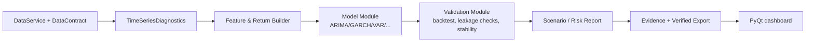

# نقشهٔ ادغام قابلیت‌های تحلیلی مالی در DataSense

**مبنای تصمیم:** پیشنهادهای تحلیلی پیوست‌شده توسط کاربر، شامل سری‌های زمانی، ریسک، بهینه‌سازی، مدل‌های بیزی و فازی، گراف، RL، تحلیل علی، حریم خصوصی و محاسبات کوانتومی.  
**موضع محصول:** DataSense در Alpha یک ابزار تحلیل محلی و قابل‌اثبات است، نه سامانهٔ اجرای معامله یا ارائهٔ توصیهٔ سرمایه‌گذاری. بنابراین، قابلیت‌های مالی تنها پس از گذر از قرارداد داده، provenance، model-risk و UX توضیح‌پذیر به محصول وارد می‌شوند.

> **اصل کنترل:** هیچ ماژول مالی نباید به‌طور پیش‌فرض سیگنال خرید/فروش، وزن پرتفوی، قیمت هدف یا اتصال به broker ایجاد کند. خروجی Alpha باید diagnostic، سناریومحور، قابل‌بازبینی و همراه با فرض‌ها، بازهٔ داده و محدودیت مدل باشد.

## ۱. قابلیت تحویل‌شده در این نسخه

`core/analysis/time_series.py` یک module عمومی **TimeSeriesDiagnosticsModule** را اضافه می‌کند. این module ستون عددی و در صورت وجود ستون زمان را محلی بررسی می‌کند و تعداد مشاهدهٔ معتبر، مقدارهای مفقود/غیرعددی، کمینه، بیشینه، میانگین، انحراف معیار، تکرار timestamp و مرتب‌بودن زمان را گزارش می‌دهد. این قابلیت آماده‌سازی داده برای تحلیل‌های بعدی است و پیش‌بینی یا توصیه معاملاتی تولید نمی‌کند.

| قابلیت | وضعیت | دلیل جایگاه |
|---|---|---|
| contract عمومی `ProcessingModule` | پیاده‌سازی‌شده | مرز ثابت برای افزودن engineهای آینده |
| `ProcessingContext` و `ProcessingResult` immutable | پیاده‌سازی‌شده | جلوگیری از coupling با UI و state سراسری |
| diagnostics سری زمانی | پیاده‌سازی‌شده | کنترل کیفیت ورودی پیش از مدل‌سازی |
| ARIMA/SARIMA، GARCH، VAR | backlog P1 | نیازمند انتخاب window، backtest بدون leakage و diagnostics residual |
| VaR/CVaR و Monte Carlo | backlog P1/P2 | نیازمند تعریف دقیق horizon، confidence و سناریوی داده |
| Black–Litterman و convex optimization | backlog P2 | نیازمند policy برای constraints، دادهٔ معتبر و disclosure مدل |
| فازی، گراف، Bayesian، causal ML | research track | باید با benchmark، explainability و model-risk gate وارد شوند |
| RL، diffusion، quantum | research-only | هزینه/ریسک بالا و خارج از نیاز Alpha |

## ۲. معماری پیشنهادی برای moduleهای مالی



هر module باید قرارداد زیر را رعایت کند:

```python
class ProcessingModule(Protocol):
    module_id: str

    def process(
        self,
        frame: pd.DataFrame,
        context: ProcessingContext,
    ) -> ProcessingResult: ...
```

`ProcessingResult` باید فقط summary، warning و artifact reference برگرداند. مدل نمی‌تواند widget PyQt، مسیر local file، secret، credential یا event telemetry تولید کند. evidence/report adapter خارج از مدل ساخته می‌شود.

## ۳. ترتیب توسعهٔ توصیه‌شده

| موج | module | ورودی لازم | خروجی مجاز | gate پذیرش |
|---|---|---|---|---|
| ۰ | Time-series diagnostics | value/timestamp column | completeness، order، variance summary | ۴۳ آزمون فعلی + fixture synthetic |
| ۱ | Return/feature builder | قیمت تعدیل‌شده، calendar، corporate actions basis | return series و data-quality report | no future-data، تعریف frequency و timezone |
| ۱ | ARIMA/SARIMA و residual diagnostics | stationary transform/seasonality config | forecast distribution و confidence metadata | walk-forward validation، baseline naive comparison |
| ۱ | GARCH/volatility diagnostics | return series و horizon | volatility estimate و model diagnostics | parameter constraints، convergence check، residual check |
| ۱ | Historical/parametric VaR و CVaR | return series و confidence/horizon | risk scenario summary | disclosure method/window، stress scenario test |
| ۲ | VAR/cointegration | aligned multivariate series | relationship diagnostics، نه causal claim | lag selection، stationarity، look-ahead test |
| ۲ | Convex/Black–Litterman | validated expected returns/covariance/constraints | scenario allocation proposal، نه execution | condition number، constraint feasibility، sensitivity table |
| ۲ | Graph/network risk | time-aligned entities | node/edge diagnostics و contagion scenario | missing graph data، stability and explainability |
| ۳ | Fuzzy scoring/ANFIS | domain-approved rules and labels | interpretable score bands + rule trace | fairness/bias review، human approval |
| ۳ | causal ML / federated learning | approved causal design/partners | research estimate with assumptions | privacy review، DPA، adversarial validation |
| R&D | RL/diffusion/quantum | controlled simulator only | simulation experiment | independent model risk review |

## ۴. model-risk و data-governance gate

هر module مالی باید پیش از visible شدن در dashboard این کنترل‌ها را تکمیل کند:

1. **Data basis:** نام ستون‌ها، adjustment basis، timezone، frequency، تاریخ آغاز/پایان و missing-data policy باید در `ProcessingContext.options` ثبت شود.
2. **Leakage control:** هر evaluation تاریخی باید cut-off زمانی و censor gap مشخص داشته باشد. training و validation نمی‌توانند data آینده را مشاهده کنند.
3. **Reproducibility:** module id، version، configuration hash و hash aggregate input باید در evidence ثبت شود؛ raw data در receipt قرار نگیرد.
4. **Stability:** عدم همگرایی، condition number نامناسب، حجم نمونه ناکافی، regime shift و sensitivity شدید باید warning blocking/advisory تولید کنند.
5. **Interpretability:** output باید assumptions، error/warning و حداقل یک baseline را کنار result نشان دهد.
6. **Human control:** قابلیت export فقط نتیجهٔ تحلیل را ثبت می‌کند؛ هیچ execution، order routing یا trade automation در scope Alpha نیست.

## ۵. قرارداد نمونه برای یک module GARCH آینده

```python
@dataclass(frozen=True)
class VolatilityConfig:
    return_column: str
    p: int = 1
    q: int = 1
    horizon_days: int = 1

class VolatilityModule:
    module_id = "volatility-garch/v1"

    def process(self, frame: pd.DataFrame, context: ProcessingContext) -> ProcessingResult:
        # 1. Verify validated return series and sufficient observations.
        # 2. Fit only on the time window allowed by context.
        # 3. Return parameters, diagnostics, warnings and artifact references.
        # 4. Never emit trade, allocation or execution instruction.
        ...
```

### معیار آزمون قبل از ورود به محصول

| گروه آزمون | نمونه |
|---|---|
| unit | input missing، nonnumeric، insufficient sample، parameter invalid |
| statistical | known synthetic process، convergence/failure، residual diagnostic |
| time integrity | unsorted timestamps، duplicate timestamps، future-data leakage |
| reproducibility | config ثابت → output/evidence metadata ثابت (به‌جز timestamp) |
| privacy | raw values، ticker private، account ID یا path در telemetry/receipt نباشد |
| UX | warning به زبان عملی؛ عدم نمایش certainty کاذب یا trade CTA |

## ۶. حداقل UX برای dashboard مالی

یک dashboard مالی آینده باید سه بخش جدا داشته باشد: **Data readiness**، **model diagnostics** و **scenario result**. نمودار بدون window، frequency، sample size و data quality badge نباید نمایش داده شود. هر کاربر باید بتواند verified export همراه با metadata-only receipt بسازد، اما receipt باید فقط model/version/config hash و aggregate summary را نگه دارد.

## ۷. تصمیم اجرایی فعلی

در این مرحله، DataSense فقط foundation لازم را پیاده کرده است: module contract، diagnostics سری زمانی، persistence نسخه‌دار، entitlement محلی، telemetry opt-in و verified export. این ترتیب عمداً قبل از مدل‌های پیچیده انجام شده، زیرا ARIMA/GARCH/VaR/optimization روی دادهٔ ناقص، زمان نامرتب یا بدون provenance نتیجهٔ قابل‌اتکا تولید نمی‌کنند.

**افشای کاربرد:** این نقشه‌راه یک طرح فنی محصول بر پایهٔ محتوای پیوست‌شدهٔ کاربر است؛ هیچ دادهٔ بازار، backtest یا توصیهٔ شخصی سرمایه‌گذاری در آن استفاده نشده است. این محتوا پژوهش و طراحی فنی است، نه مشاورهٔ مالی شخصی.


## ۸. بازنگری عمیق‌تر: از «فهرست الگوریتم» به «قابلیتِ قابل‌اعتماد»

فهرست روش‌های پیشنهادی، از آمار مقاوم و سری زمانی تا بهینه‌سازی، گراف، یادگیری عمیق، استنتاج علّی، حریم خصوصی تفاضلی و محاسبات کوانتومی، از نظر **ریسک تصمیم، نیاز داده و قابلیت ممیزی** هم‌وزن نیستند. برای DataSense، انتخاب درست از تعداد الگوریتم‌ها مهم‌تر است: هر قابلیت باید ابتدا مسئلهٔ کاربر، definition داده، مرز استفاده، روش اعتبارسنجی و محدودیت قابل‌خواندن داشته باشد. این رویکرد با چهار کارکرد Govern/Map/Measure/Manage در چارچوب NIST AI RMF هم‌راستاست؛ NIST این چارچوب را برای واردکردن ملاحظات trustworthiness در طراحی، توسعه، استفاده و ارزیابی سامانه‌های AI معرفی می‌کند. [1]

راهنمای رسمی مدیریت ریسک مدل فدرال رزرو نیز مدل را رویکرد کمی پیچیده‌ای می‌داند که نظریه‌های آماری، اقتصادی یا مالی را برای تبدیل دادهٔ ورودی به برآورد کمی به‌کار می‌گیرد؛ به همین دلیل، کیفیت input، پیچیدگی، هدف و میزان اتکای تصمیم از عوامل ریسک‌اند. همان منبع بر validation متناسب با کاربرد و materiality، از جمله آزمون out-of-sample/out-of-time، سنجش کیفیت داده و مقایسهٔ روش‌ها یا فرض‌های جایگزین تأکید دارد. [2] این‌ها در DataSense به **gate محصول** تبدیل می‌شوند، نه به ادعای انطباق مقرراتی.

| خوشهٔ روش | ارزش بالقوه برای DataSense | پیش‌نیاز غیرقابل‌حذف | وضعیت محصول و تصمیم |
|---|---|---|---|
| Data readiness، آمار توصیفی، robust/IQR، integrity زمان | تشخیص خطا و آمادگی داده پیش از هر مدل | schema، missing/non-finite policy، timestamp basis، provenance محلی | **پیاده‌سازی‌شده/اولویت نخست**؛ `DataReadinessInsightsModule`، diagnostics سری زمانی و گزارش خودکار aggregate-only. |
| ARIMA/SARIMA، ETS، baselineهای ساده، residual diagnostics | پیش‌بینی عملیاتی با توضیح‌پذیری نسبی | split زمانی، benchmark naive، uncertainty، آزمون out-of-time و rollback | **P1**؛ فقط forecast distribution و diagnostics، بدون توصیهٔ معامله یا تصمیم خودکار. |
| GARCH، VaR/CVaR، Monte Carlo، stress scenario | گزارش سناریوی ریسک برای دادهٔ بازدهِ تعریف‌شده | adjusted-return basis، horizon/confidence، regime/sensitivity test، tail limitations | **P1/P2**؛ descriptive scenario با افشای window و فرض‌ها، نه risk limit یا action. |
| VAR، PCA/factor، graph/network، transfer entropy | فشرده‌سازی/وابستگی و اکتشاف ساختار | alignment زمانی، stationarity/conditioning، multiple-testing controls، عدم‌تعبیر علّی | **P2 research-to-prototype**؛ خروجی باید association باشد، نه causal claim. |
| convex optimization، Black–Litterman، game theory، LP | تحلیل feasibility یا sensitivity در یک سناریوی تعریف‌شده | expected-return/covariance provenance، constraints، feasibility، baseline و sensitivity | **P2 با بازبینی انسانی**؛ فقط allocation scenario غیرقابل‌اجرا و بدون broker/order routing. |
| Bayesian/causal ML، fuzzy/ANFIS، NLP، anomaly detection | بیان عدم‌قطعیت، rule trace و تشخیص احتمالاً غیرعادی | label/data-generating assumptions، bias/fairness، leakage test، explanation | **P3**؛ نیازمند model card، evaluation dataset و کنترل ادعای علّی. |
| LSTM/Transformer، diffusion، RL، quantum | پژوهش محدود در مسئله‌های واقعاً توجیه‌شده | baseline قوی، compute budget، reproduceability، independent challenge، simulator | **R&D only**؛ تا زمانی که یک use case و برتری بازتولیدپذیر بر baseline ثابت نشده، وارد Alpha نمی‌شود. |
| Federated learning و differential privacy | کاهش exposure در همکاری چندطرفه | threat model، contribution policy، privacy budget، utility test، governance طرفین | **Research only**؛ local-first به‌تنهایی differential privacy نیست. NIST SP 800-226، DP را چارچوبی برای کمی‌سازی privacy loss معرفی و بر hazards اجرایی آن تأکید می‌کند. [3] |

### قابلیت ایمنِ اجراشده در روزهای ۱۰ و ۱۱

به‌جای افزودن زودهنگام یک مدل مالی پیچیده، این iteration یک جزء کم‌ریسک اما زیربنایی را تحویل می‌دهد: `AutomatedReportService`. این سرویس فقط `DatasetProfile`، خروجی `data-readiness-insights/v1` و `QualityReport` اختیاری می‌گیرد؛ **DataFrame را نمی‌پذیرد**. HTML و manifest به‌شکل atomic ساخته می‌شوند و در manifest فقط digest، شکل dataset، وضعیت quality، امتیاز readiness و برچسب privacy نگهداری می‌شود. بنابراین، این قابلیت evidence و بازبینی را تقویت می‌کند، ولی forecast، signal، weight، price target، risk limit یا معامله تولید نمی‌کند.

گزارش استاندارد محلی می‌تواند کیفیت `blocked` را شفاف نشان دهد تا عیب‌یابی ممکن باشد؛ با این حال، آن یک artifact signed/verified نیست. مسیر `VerifiedExportService` و quality gate مستقل باقی می‌ماند. این مرزبندی، قابلیت مشاهده‌پذیری را از ادعای اعتماد یا اجازهٔ اقدام جدا می‌کند.

### Model-risk gate پیشنهادی پیش از هر مدل جدید

هر مدل آینده باید پیش از قرارگیری در UI یا export از یک **ثبت تصمیم (ADR) و model card** گذر کند. این الزام internal product control است و جایگزین مقررات، validation مستقل سازمانی یا مشاورهٔ مالی نیست.

| Gate | evidence حداقلی لازم | رد/هشدار blocking |
|---|---|---|
| مسئله و use boundary | هدف، کاربر، تصمیم مجاز/غیرمجاز، تعریف عدم‌قطعیت و owner | هدف مبهم، ادعای causal یا action بدون scope مصوب. |
| Data provenance | منبع، دوره، timezone، frequency، adjustment basis، schema/config hash، missing policy | نبود بازهٔ زمانی، ambiguous adjusted/unadjusted basis، یا source حساس در artifact عمومی. |
| Temporal integrity | cut-off، train/validation/test زمان‌محور، censor gap، no-future-data test | leakage، timestamp تکراری/نامرتب بدون policy، یا split تصادفی برای مسئلهٔ زمانی. |
| Baseline و validation | baseline ساده، out-of-time metric، residual/diagnostic، confidence interval یا uncertainty statement | نبود benchmark، sample ناکافی، convergence failure یا performance degradation بدون warning. |
| Stability و scenario | sensitivity به window/parameter، regime-shift test، stress/failure path | نتایج شکننده، condition نامناسب یا خروج از دامنهٔ داده بدون caveat. |
| Explainability و human control | assumptions، config، limitation، advisory language، مسیر review/override | CTA خرید/فروش، اجرای خودکار، certainty کاذب یا عدم‌وجود review انسانی. |
| Privacy و evidence | aggregate-only receipt/report، redaction test، retention، threat model در DP/federated case | raw value/path/credential در log/report یا privacy claim بدون measurement. |

## ۹. برنامهٔ اجرایی مصوب پس از Alpha

در اولین گام بعدی، به‌جای شروع با شبکهٔ عمیق یا optimization، یک `ForecastValidationModule` عمومی طراحی می‌شود. این ماژول ابتدا `TimeSeriesDiagnosticsModule` را gate می‌کند، سپس فقط baselineهای شفاف مانند naive/seasonal-naive را با walk-forward evaluation مقایسه می‌کند و metadata window، sample count، metric و failure warning را در evidence می‌نویسد. ARIMA/SARIMA تنها وقتی وارد این مسیر می‌شود که baseline و fixtureهای synthetic/real مجاز موجود باشند.

برای ریسک، `ScenarioRiskModule` باید ابتدا تعریف بازده، horizon، confidence level و policy داده را به‌شکل immutable config دریافت کند. خروجی نخست آن فقط historical distribution، loss quantile و shortfall سناریویی با disclaimerهای روش‌شناختی خواهد بود. از آن برای تعیین سفارش، limit، suitability، pricing شخصی یا توصیهٔ سرمایه‌گذاری استفاده نمی‌شود.

قابلیت‌های DP و federated learning فقط پس از تعریف threat model و همکاری واقعیِ چندطرفه بررسی می‌شوند. هیچ‌کدام صرفاً با حذف نام یا local بودن پردازش حاصل نمی‌شود؛ لازم است privacy loss/utility و مخاطرات پیاده‌سازی نیز قابل‌ارزیابی باشند. [3]

### مراجع

[1] [NIST، AI Risk Management Framework](https://www.nist.gov/itl/ai-risk-management-framework)

[2] [Federal Reserve، Supervisory Guidance on Model Risk Management](https://www.federalreserve.gov/frrs/guidance/supervisory-guidance-on-model-risk-management.htm)

[3] [NIST SP 800-226، Guidelines for Evaluating Differential Privacy Guarantees](https://www.nist.gov/publications/guidelines-evaluating-differential-privacy-guarantees)
