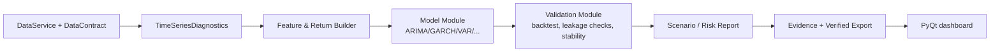

# نقشهٔ ادغام قابلیت‌های تحلیلی مالی در DataSense

**مبنای تصمیم:** پیشنهادهای تحلیلی پیوست‌شده توسط کاربر، شامل سری‌های زمانی، ریسک، بهینه‌سازی، مدل‌های بیزی و فازی، گراف، RL، تحلیل علی، حریم خصوصی و محاسبات کوانتومی.  
**موضع محصول:** DataSense در Alpha یک ابزار تحلیل محلی و قابل‌اثبات است، نه سامانهٔ اجرای معامله یا ارائهٔ توصیهٔ سرمایه‌گذاری. بنابراین، قابلیت‌های مالی تنها پس از گذر از قرارداد داده، provenance، model-risk و UX توضیح‌پذیر به محصول وارد می‌شوند.

> **اصل کنترل:** هیچ ماژول مالی نباید به‌طور پیش‌فرض سیگنال خرید/فروش، وزن پرتفوی، قیمت هدف یا اتصال به broker ایجاد کند. خروجی Alpha باید diagnostic، سناریومحور، قابل‌بازبینی و همراه با فرض‌ها، بازهٔ داده و محدودیت مدل باشد.

## ۱. قابلیت تحویل‌شده در این نسخه

`core/analysis/time_series.py` یک module عمومی **TimeSeriesDiagnosticsModule** را اضافه می‌کند. این module ستون عددی و در صورت وجود ستون زمان را محلی بررسی می‌کند و تعداد مشاهدهٔ معتبر، مقدارهای مفقود/غیرعددی، کمینه، بیشینه، میانگین، انحراف معیار، تکرار timestamp و مرتب‌بودن زمان را گزارش می‌دهد. این قابلیت آماده‌سازی داده برای تحلیل‌های بعدی است و پیش‌بینی یا توصیه معاملاتی تولید نمی‌کند.

| قابلیت | وضعیت | دلیل جایگاه |
|---|---|---|
| contract عمومی `ProcessingModule` | پیاده‌سازی‌شده | مرز ثابت برای افزودن engineهای آینده |
| `ProcessingContext` و `ProcessingResult` immutable | پیاده‌سازی‌شده | جلوگیری از coupling با UI و state سراسری |
| diagnostics سری زمانی | پیاده‌سازی‌شده | کنترل کیفیت ورودی پیش از مدل‌سازی |
| ARIMA/SARIMA، GARCH، VAR | backlog P1 | نیازمند انتخاب window، backtest بدون leakage و diagnostics residual |
| VaR/CVaR و Monte Carlo | backlog P1/P2 | نیازمند تعریف دقیق horizon، confidence و سناریوی داده |
| Black–Litterman و convex optimization | backlog P2 | نیازمند policy برای constraints، دادهٔ معتبر و disclosure مدل |
| فازی، گراف، Bayesian، causal ML | research track | باید با benchmark، explainability و model-risk gate وارد شوند |
| RL، diffusion، quantum | research-only | هزینه/ریسک بالا و خارج از نیاز Alpha |

## ۲. معماری پیشنهادی برای moduleهای مالی



هر module باید قرارداد زیر را رعایت کند:

```python
class ProcessingModule(Protocol):
    module_id: str

    def process(
        self,
        frame: pd.DataFrame,
        context: ProcessingContext,
    ) -> ProcessingResult: ...
```

`ProcessingResult` باید فقط summary، warning و artifact reference برگرداند. مدل نمی‌تواند widget PyQt، مسیر local file، secret، credential یا event telemetry تولید کند. evidence/report adapter خارج از مدل ساخته می‌شود.

## ۳. ترتیب توسعهٔ توصیه‌شده

| موج | module | ورودی لازم | خروجی مجاز | gate پذیرش |
|---|---|---|---|---|
| ۰ | Time-series diagnostics | value/timestamp column | completeness، order، variance summary | ۴۳ آزمون فعلی + fixture synthetic |
| ۱ | Return/feature builder | قیمت تعدیل‌شده، calendar، corporate actions basis | return series و data-quality report | no future-data، تعریف frequency و timezone |
| ۱ | ARIMA/SARIMA و residual diagnostics | stationary transform/seasonality config | forecast distribution و confidence metadata | walk-forward validation، baseline naive comparison |
| ۱ | GARCH/volatility diagnostics | return series و horizon | volatility estimate و model diagnostics | parameter constraints، convergence check، residual check |
| ۱ | Historical/parametric VaR و CVaR | return series و confidence/horizon | risk scenario summary | disclosure method/window، stress scenario test |
| ۲ | VAR/cointegration | aligned multivariate series | relationship diagnostics، نه causal claim | lag selection، stationarity، look-ahead test |
| ۲ | Convex/Black–Litterman | validated expected returns/covariance/constraints | scenario allocation proposal، نه execution | condition number، constraint feasibility، sensitivity table |
| ۲ | Graph/network risk | time-aligned entities | node/edge diagnostics و contagion scenario | missing graph data، stability and explainability |
| ۳ | Fuzzy scoring/ANFIS | domain-approved rules and labels | interpretable score bands + rule trace | fairness/bias review، human approval |
| ۳ | causal ML / federated learning | approved causal design/partners | research estimate with assumptions | privacy review، DPA، adversarial validation |
| R&D | RL/diffusion/quantum | controlled simulator only | simulation experiment | independent model risk review |

## ۴. model-risk و data-governance gate

هر module مالی باید پیش از visible شدن در dashboard این کنترل‌ها را تکمیل کند:

1. **Data basis:** نام ستون‌ها، adjustment basis، timezone، frequency، تاریخ آغاز/پایان و missing-data policy باید در `ProcessingContext.options` ثبت شود.
2. **Leakage control:** هر evaluation تاریخی باید cut-off زمانی و censor gap مشخص داشته باشد. training و validation نمی‌توانند data آینده را مشاهده کنند.
3. **Reproducibility:** module id، version، configuration hash و hash aggregate input باید در evidence ثبت شود؛ raw data در receipt قرار نگیرد.
4. **Stability:** عدم همگرایی، condition number نامناسب، حجم نمونه ناکافی، regime shift و sensitivity شدید باید warning blocking/advisory تولید کنند.
5. **Interpretability:** output باید assumptions، error/warning و حداقل یک baseline را کنار result نشان دهد.
6. **Human control:** قابلیت export فقط نتیجهٔ تحلیل را ثبت می‌کند؛ هیچ execution، order routing یا trade automation در scope Alpha نیست.

## ۵. قرارداد نمونه برای یک module GARCH آینده

```python
@dataclass(frozen=True)
class VolatilityConfig:
    return_column: str
    p: int = 1
    q: int = 1
    horizon_days: int = 1

class VolatilityModule:
    module_id = "volatility-garch/v1"

    def process(self, frame: pd.DataFrame, context: ProcessingContext) -> ProcessingResult:
        # 1. Verify validated return series and sufficient observations.
        # 2. Fit only on the time window allowed by context.
        # 3. Return parameters, diagnostics, warnings and artifact references.
        # 4. Never emit trade, allocation or execution instruction.
        ...
```

### معیار آزمون قبل از ورود به محصول

| گروه آزمون | نمونه |
|---|---|
| unit | input missing، nonnumeric، insufficient sample، parameter invalid |
| statistical | known synthetic process، convergence/failure، residual diagnostic |
| time integrity | unsorted timestamps، duplicate timestamps، future-data leakage |
| reproducibility | config ثابت → output/evidence metadata ثابت (به‌جز timestamp) |
| privacy | raw values، ticker private، account ID یا path در telemetry/receipt نباشد |
| UX | warning به زبان عملی؛ عدم نمایش certainty کاذب یا trade CTA |

## ۶. حداقل UX برای dashboard مالی

یک dashboard مالی آینده باید سه بخش جدا داشته باشد: **Data readiness**، **model diagnostics** و **scenario result**. نمودار بدون window، frequency، sample size و data quality badge نباید نمایش داده شود. هر کاربر باید بتواند verified export همراه با metadata-only receipt بسازد، اما receipt باید فقط model/version/config hash و aggregate summary را نگه دارد.

## ۷. تصمیم اجرایی فعلی

در این مرحله، DataSense فقط foundation لازم را پیاده کرده است: module contract، diagnostics سری زمانی، persistence نسخه‌دار، entitlement محلی، telemetry opt-in و verified export. این ترتیب عمداً قبل از مدل‌های پیچیده انجام شده، زیرا ARIMA/GARCH/VaR/optimization روی دادهٔ ناقص، زمان نامرتب یا بدون provenance نتیجهٔ قابل‌اتکا تولید نمی‌کنند.

**افشای کاربرد:** این نقشه‌راه یک طرح فنی محصول بر پایهٔ محتوای پیوست‌شدهٔ کاربر است؛ هیچ دادهٔ بازار، backtest یا توصیهٔ شخصی سرمایه‌گذاری در آن استفاده نشده است. این محتوا پژوهش و طراحی فنی است، نه مشاورهٔ مالی شخصی.
